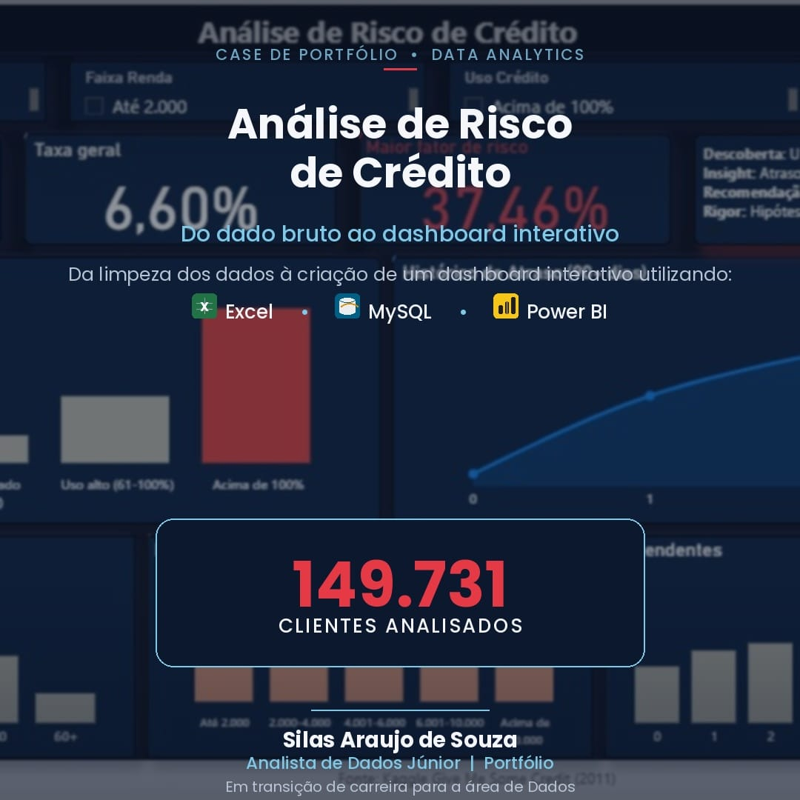
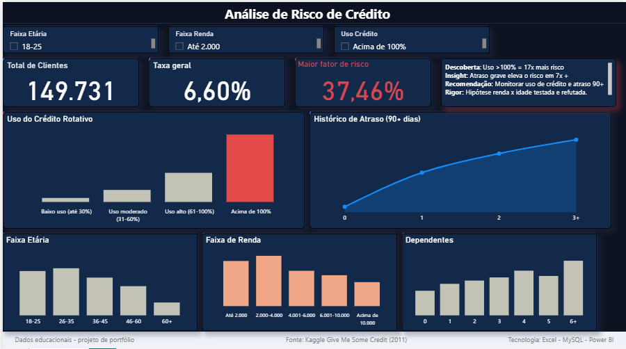
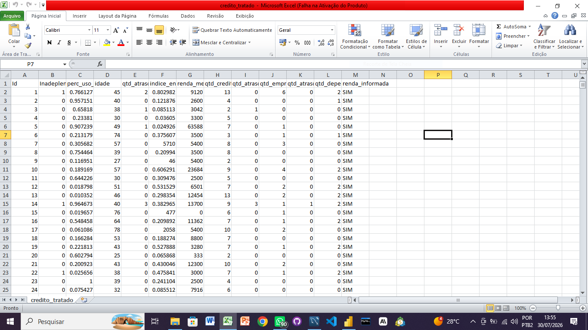
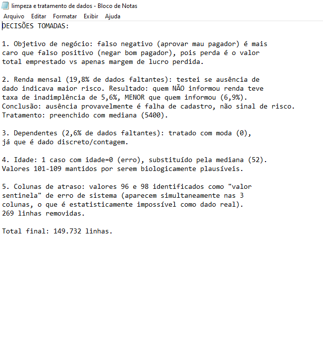
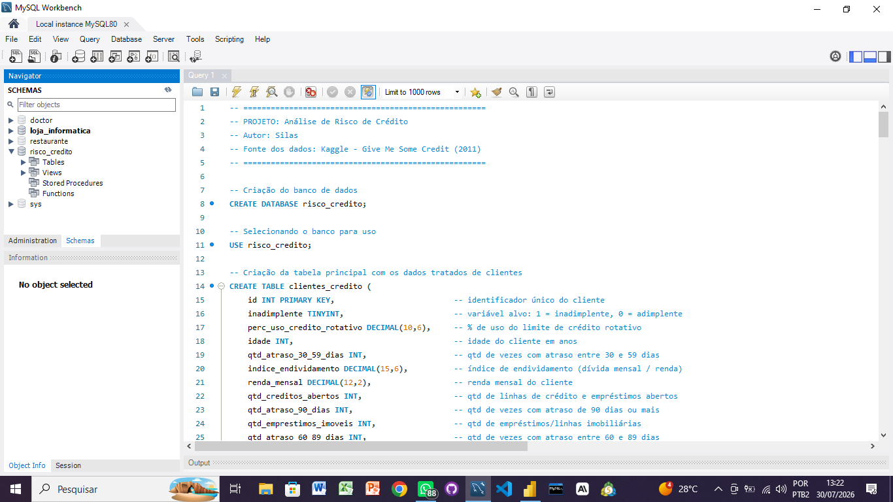
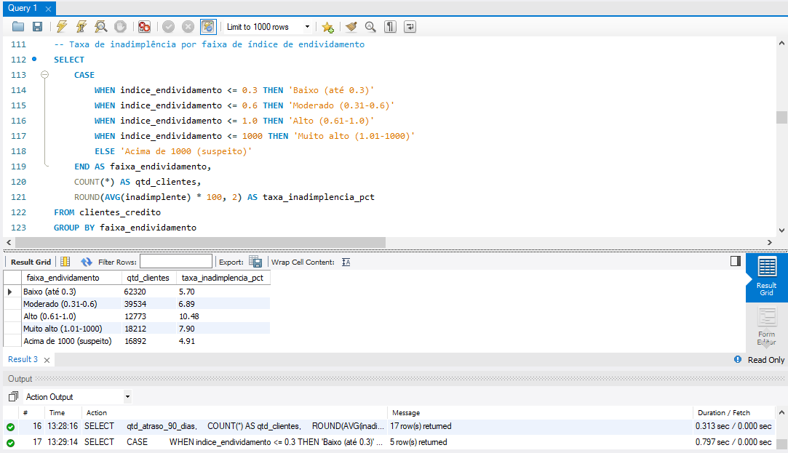

# 📊 Análise de Risco de Crédito

Projeto completo de análise de dados: da limpeza no Excel, passando por
SQL (MySQL), até um dashboard interativo no Power BI — simulando o
trabalho de um analista júnior avaliando risco de inadimplência de
crédito para uma fintech.

## 📸 Dashboard

  
  

  
  

  
  

## 🎯 Objetivo

Identificar os principais fatores associados à inadimplência de
clientes de crédito, com base em um dataset real (Kaggle, 2011),
e traduzir os achados em recomendações de negócio.

## 🧭 Contexto de Negócio

O ponto de partida do projeto foi uma pergunta de negócio, não uma
ferramenta: qual erro custa mais caro para a empresa — aprovar um
cliente que não paga (perda de 100% do valor emprestado) ou recusar
um cliente que pagaria (perda apenas da margem de lucro futura)?
Essa definição orienta toda a análise.

## 🗃️ Fonte dos Dados
[Give Me Some Credit — Kaggle](https://www.kaggle.com/c/GiveMeSomeCredit/data)
150.000 registros → 149.731 após limpeza.

## 🔍 Principais Insights

- **Uso do crédito rotativo** é o preditor mais forte: 2,22% (baixo
  uso) → 37,46% (acima de 100% do limite) — 17x de diferença.
- **Histórico de atraso 90+ dias**: de 4,63% (sem atraso) a 67%
  (4+ ocorrências).
- **Hipótese testada e refutada**: o grupo de menor renda não é
  dominado por jovens, e sim por clientes 60+.
- **Investigação de causa raiz**: identificado que o índice de
  endividamento "explode" matematicamente quando a renda é próxima
  de zero — não representa risco real sem tratamento adicional.

## 🛠️ Tecnologias
Excel · MySQL / MySQL Workbench · Power BI

## 📁 Estrutura do repositório
